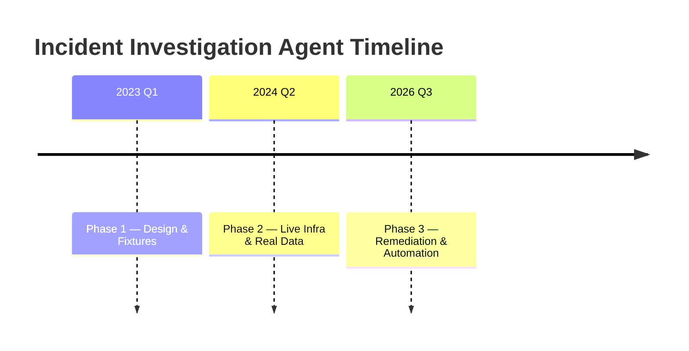

# Incident Investigation Agent

A multi-stage AI-powered system for automated root-cause analysis and remediation of production incidents.

**Executive summary:** The agent progresses through three phases:

1. **Phase 1 — Fixtures:** Deterministic scenarios and ground-truth testing against a fixed LLM answer key.
2. **Phase 2 — Live Infra:** Real Dockerized services (FastAPI) with Prometheus metrics, real logs, and fault injection. The same investigation logic now queries real data (PromQL/LogQL) instead of fixtures.
3. **Phase 3 — Remediation:** After a hypothesis, a deterministic rule-based mapper selects a fix (e.g. `restart_service`), gated by a human approval workflow. Narrow, automated fixes (restart, reset fault) are executed and then verified by replaying the original evidence queries. The agent also templates prevention alerts and exports incident scenarios for regression testing.

This README documents everything implemented across Phases 1–3 (file paths, behavior, usage), notes key design decisions and the problems we hit along the way (Docker networking, Git LFS), and lays out what's next. It includes setup/run instructions, an API reference, a feature status table, a project timeline, safety guardrails, and a troubleshooting checklist.

---

## Table of Contents

- [Setup & Running Locally](#setup--running-locally)
- [API & Usage Examples](#api--usage-examples)
- [Implemented Features (Phases 1–3)](#implemented-features-phases-13)
  - [Phase 1 — Fixtures](#phase-1--fixture-based-investigation)
  - [Phase 2 — Live Infrastructure](#phase-2--live-infrastructure)
  - [Phase 3 — Remediation & Verification](#phase-3--remediation-verification-prevention-regression-capture)
- [Security & Guardrails](#security--guardrails)
- [Troubleshooting Checklist](#troubleshooting-checklist)
- [Next Steps](#next-steps)
- [Timeline & Feature Table](#timeline--feature-table)

---

## Setup & Running Locally

**Prerequisites:** Docker (with Compose), Python 3.10+, pip, and git.

Clone the repo and install dependencies:

```bash
git clone <repository-url>
cd codebase-qa-agent
pip install -r requirements.txt
```

Add a valid LLM API key as the environment variable `GROQ_API_KEY` in your shell, or in a `.env` file.

### Docker Compose

The stack includes `api` (FastAPI), `redis`, and `qdrant` services. Configuration lives in `docker-compose.yml`.

**Networking notes:**

- Don't publish internal service ports unless you need to. For example, remove the `6380:6379` host mapping for Redis so it stays internal-only.
- Inside the `api` container, use `REDIS_URL=redis://redis:6379` (the service name `redis` resolves via Docker DNS) and `QDRANT_URL=http://qdrant:6333`.
- On the host (Windows), map only the API port:

  ```yaml
  ports:
    - "8001:8000"   # Host 8001 -> container 8000
  ```

  Then access the API at `http://localhost:8001`. (Render uses the `$PORT` env var and expects binding to `0.0.0.0`.)

### Prometheus & Grafana

The stack includes a Prometheus container scraping our services on `/metrics` every 5s. No Grafana by default, but you can add one if you want dashboards.

### Fault Injection

Use the provided UI or the CLI to trigger faults. For example, to inject a memory leak in `checkout-service`:

```bash
CHECKOUT_FAULT_MODE=memory_leak docker compose up -d checkout-service
```

Supported fault modes simulate connection-pool leaks, memory leaks, CPU saturation, file-descriptor leaks, or a "bad deploy" error. The UI at `localhost:8001` (Swagger: `/docs`) also has an endpoint to trigger faults.

### Run the API

Via Docker Compose:

```bash
docker compose up
```

Or directly:

```bash
uvicorn app.main:app --reload --host 0.0.0.0 --port 8000
```

On Render, ensure the service binds to `0.0.0.0:$PORT` (defaults to `10000` if `$PORT` isn't set).

### Verify the Environment

`docker compose ps` should show all services `Up` (Redis, Qdrant, API). Then check the API is reachable:

```bash
curl http://localhost:8001/health
```

(PowerShell: `Invoke-RestMethod http://localhost:8001/health`)

---

## API & Usage Examples

Main endpoints, per `app/main.py`:

| Method | Endpoint | Description |
|---|---|---|
| `POST` | `/incidents` | Report a new incident. Body: `{"description": "...", "scenario_id": "..."}`. Returns an incident ID and initial triage. |
| `GET` | `/incidents/{id}` | Retrieve incident state by ID. |
| `POST` | `/incidents/{id}/approval` | Human approval. Body: `{"decision": "approved"}` or `{"decision": "rejected"}`. |
| `POST` | `/incidents/{id}/execute` | Execute the mapped remediation action (after approval). Triggers a container restart or fault reset. |
| `POST` | `/incidents/{id}/verify` | Re-run evidence queries to check whether the issue is resolved. |
| `POST` | `/incidents/{id}/export` | **Scenario export** — captures the incident as a fixture JSON for regression testing. Live mode only. |
| `GET` | `/scenarios` | List available fixture scenarios (Phase 1 ground-truth testing). |

### Example workflow (memory-leak fault)

**1. Inject a fault** and drive traffic to trigger high memory usage.

**2. Report the incident:**

```bash
curl -X POST http://localhost:8001/incidents \
  -H "Content-Type: application/json" \
  -d '{"description": "checkout-service memory usage climbing"}'
```

This returns an `incident_id` and triage info (category, confidence, risk category, etc).

**3. Approve the action** (if required):

```bash
curl -X POST http://localhost:8001/incidents/<id>/approval \
  -H "Content-Type: application/json" \
  -d '{"decision": "approved"}'
```

**4. Execute the fix:**

```bash
curl -X POST http://localhost:8001/incidents/<id>/execute
```

The agent restarts the container or resets the fault mode.

**5. Verify resolution:**

```bash
curl -X POST http://localhost:8001/incidents/<id>/verify
```

The response shows `overall_status = "resolved"` once every cited metric/log anomaly has cleared.

See the Phase 3 testing example above for the full step-by-step flow.

---

## Implemented Features (Phases 1–3)

### Phase 1 — Fixture-based Investigation

- **Fixtures & Ground Truth** (`app/fixtures.py`, `app/fixtures/*.py`) — Deterministic fault scenarios with pre-defined metric/log signatures and ground-truth root causes, used to test the agent logic in isolation.
- **State Management** (`app/state.py`) — Defines the data carried through the whole pipeline (category, triage confidence, hypothesis, cited evidence entries, etc).
- **Tool Modules** (`app/tools/`) — Stubbed-out modules for metrics, logs, deploys, topology, and similar-incident search. Each returns synthetic evidence from fixtures.
- **Triage Agent** (`app/agents/triage.py`) — Classifies incident descriptions into categories (e.g. `resource_exhaustion`, `timeout`) with a confidence score, no history required.
- **Investigation Agent** (`app/agents/investigation.py`) — A ReAct-style loop (LangGraph) that iteratively asks the LLM to pick a tool, gathers evidence (metrics, logs, deploys, dependencies), and refines the hypothesis. Cited evidence carries `signal` (positive/negative) tags. Implements stopping rules.
- **Response Agent** (`app/agents/response.py`) — Uses the LLM (with a groundedness check) to produce a final root-cause and recommendation when no deterministic rule matches. A confidence ladder (0.8 / 0.6 / 0.3 / 0.2) maps to risk categories.
- **Reasoning Trace Logging** (`app/graph.py`) — Streams agent reasoning as SSE (server-sent events) for a live UI.

These components behave identically in fixture mode and live mode — only the data source differs.

### Phase 2 — Live Infrastructure

- **Real Services** — Each service (e.g. `checkout-service`) is a real FastAPI container with multiple fault modes (`pool_leak`, `memory_leak`, `cpu_saturation`, `fd_leak`, `bad_deploy`), each altering its own Prometheus metrics and logs. `bad_deploy` simulates a deployment bug.
- **Prometheus Integration** — A real Prometheus container scrapes `/metrics` from each service. The agent discovers metric names at runtime (filtered by `service=checkout-service`) instead of hardcoding them, then builds PromQL for anomaly checks.
- **Anomaly Detection** (`app/tools/metrics.py`) — Statistical comparison of a pre-fault baseline window against a fault window. Normal metrics use a z-score threshold; flat baselines (`std=0`) fall back to an absolute-change threshold to avoid infinite z-scores.
- **Real Logs (LogQL-style)** — The agent composes LogQL-like queries (e.g. `{service="checkout-service"} |= "error"`). `tools/logs_live.py` parses the actual JSON logs under `infra/logs/`, returns up to 50 recent matches, and flags whether they indicate an error.
- **Deploy History** — `tools/deploys_live.py` reads a real deploy log file so the agent can query recent deploy timestamps for a service. The agent's prompt explicitly guards against blaming a deploy without evidence ("a recent deployment does not automatically imply causation").
- **Dependency Discovery** — The agent consults a static service-dependency topology (e.g. `checkout → inventory → db`) only when evidence (an error, a downstream outage) suggests a link.
- **Investigation Logic Enhancements** — The reasoning prompt treats triage as a hypothesis (not a fact), distinguishes symptom from cause, and encourages considering multiple hypotheses. A final **groundedness check** re-runs the cited evidence: if the hypothesis isn't actually supported by what came back, confidence is lowered.
- **Stream vs Batch** — The front end can show live streaming progress of evidence-gathering (SSE via `app/graph.py`), not just the final output.
- **External Library Handling** — The agent tolerates optional dependencies failing (e.g. `torch`) by reporting and continuing rather than crashing.
- **Fault Injection UI** — A simple, admin-token-protected UI lets you trigger a fault (e.g. a memory leak) with a click and watch real-time metrics in Grafana, without touching the CLI.

### Phase 3 — Remediation, Verification, Prevention, Regression Capture

Phase 3 adds deterministic, non-LLM steps *after* diagnosis. Nothing about how evidence is gathered changes — these steps consume the final hypothesis and evidence to take action.

- **Remediation Mapping** (`app/remediation/mapper.py`) — A rules table mapping structured evidence to actions. For example, if the hypothesis is a resource leak and the cited evidence queried memory, the rule suggests `restart_service`. Rules inspect the cited PromQL query text and the triage category — not hypothesis wording — so a match always ties back to a real, discovered metric name. Each rule yields an `action_type` (`"restart_service"`, `"reset_fault_mode"`, or `None` if there's no safe auto-fix). If no rule matches, or confidence is below 0.5, nothing is auto-proposed and the LLM's advice is used instead.
- **Human Approval Gate** (`app/agents/approval_gate.py`) — Sets `approval_status = "pending"` for any risk category other than `auto_apply_safe`. The pipeline halts until a human calls `POST /incidents/{id}/approval` with `"approved"` or `"rejected"`. (Even an item flagged `do_not_apply` can be approved for *manual* handling — it just can never be auto-executed.)
- **Remediation Executor** (`app/remediation/executor.py`) — Standalone endpoint (`POST /incidents/{id}/execute`). Supports exactly two actions, the only ones exercised in Phase 2 testing:
  - `restart_service` — runs `docker compose restart <service>`. Clears in-memory leaked state, but the fault-mode env var stays set, so the issue recurs if traffic continues.
  - `reset_fault_mode` — runs `docker compose up -d --force-recreate` with `FAULT_MODE=none`. Permanently removes the injected fault, fully resolving the issue.

  Guardrails enforced in code: execution only runs if approved; a `do_not_apply` risk category is always refused regardless of approval; an already-succeeded action is never re-run; and the client can't override which action type runs — it's always whatever the mapper decided.
- **Post-Remediation Verification** (`app/verification/verify.py`) — Standalone endpoint (`POST /incidents/{id}/verify`). Replays the exact queries cited as evidence (both PromQL and LogQL) and checks whether the anomalous signal has cleared. Metrics are re-run through `detect_anomaly()`; logs are expected to return zero matches. `overall_status = "resolved"` only if *every* cited signal has cleared.
- **Prevention Rule Generator** (`app/prevention/prevention_rules.py`) — After every incident response, the agent suggests Prometheus alert expressions based on the anomalies it found, computing a threshold between the baseline and incident values. Read-only, output alongside the response, meant to help ops catch the same issue earlier next time.
- **Regression Scenario Export** (`app/fixtures/scenario_export.py`) — `POST /incidents/{id}/export_scenario` lets an operator capture a live incident as a new fixture. It re-queries Prometheus and the logs for the cited evidence windows and writes a JSON file under `app/fixtures/exported/`. The hypothesis is written into `ground_truth`, flagged as verified only if `/verify` already succeeded. Exports are **not** auto-included — a human should review and move them into `ALL_SCENARIOS`.

> **Rollback and Postmortems — status callout**
>
> Two items are sometimes described elsewhere as "done" and aren't, quite. To be precise about where they actually stand:
>
> - **Deployment rollback** is 🚧 **partially implemented**. The mapper already recognizes a deploy-regression pattern and *recommends* "roll back to the previous deployment" as text — but there is no real deploy/versioning system behind it, so nothing in the executor can actually perform a rollback yet. It's close (the detection and recommendation half is solid), but the execution half is still to come.
> - **Postmortem generation** is ❌ **not implemented yet**. We're actively planning to build this — the data needed (evidence, hypothesis, timeline, verification result) already exists in `IncidentState` and could be templated into a postmortem doc — but no generator exists in the codebase today. Treat any earlier "implemented" mention of this as aspirational, not current.

---

## Security & Guardrails

- **Human-in-the-loop** — No automated write action occurs without explicit approval. The agent can propose fixes, but an operator must call `/approval` and then `/execute`.
- **Limited actions** — The executor supports exactly two pre-defined actions (`restart_service`, `reset_fault_mode`). Anything else (scaling, a permanent config change) is only ever recommended as text.
- **One-shot execution** — A given incident's remediation can't be re-run once it has succeeded; `execution_status` tracks this to prevent loops.
- **No overriding risk** — Incidents flagged `do_not_apply` can never be auto-executed, even once approved — they require manual handling.
- **Port binding** — On Render, the app must bind to `0.0.0.0` on the specified port (`$PORT`, default `10000`), or health checks fail.
- **Least privilege** — The fault-injection UI and scenario export both require an admin token (configured in `app/main.py`), so only authorized users can mutate or export system state.

---

## Troubleshooting Checklist

- **`ModuleNotFoundError: No module named 'app.models'`** — The `app/models/` directory (with `__init__.py`) wasn't committed. Make sure `app/models/chunk.py` and `app/models/__init__.py` are in Git, and check `.gitignore` isn't excluding them.
- **Missing tokenizer/model files** — The embedder needs the model files under `models/bge-small/` (`tokenizer.json`, `model.onnx`, etc). If your `.gitignore` has a bare `models/` entry, change it to `/models/` so only the top-level ignore applies, then:
  ```bash
  git add -f models/bge-small/model.onnx
  ```
- **Git push fails on a large file (Git LFS)** — GitHub rejects files over 100 MB. Track the ONNX file with LFS:
  ```bash
  git lfs install
  git lfs track "models/bge-small/model.onnx"
  git add .gitattributes
  git rm --cached models/bge-small/model.onnx
  git add -f models/bge-small/model.onnx
  git commit -m "Use Git LFS for model.onnx"
  git push origin main
  ```
- **Docker Compose networking** — Inside the `api` container, use service names (`redis`, `qdrant`), not `localhost`. Compose's default bridge network resolves containers by service name. Only expose a service via `ports:` if the host genuinely needs to reach it directly — keep DB/Redis internal otherwise.
- **Port binding, host vs container** — `ports: ["8001:8000"]` maps host port 8001 to container port 8000. On the host, the API is at `localhost:8001` even though it listens on 8000 internally. (Render uses `$PORT` instead — bind to `0.0.0.0` and that env var.)
- **Redis: host vs Docker DNS** — From your host machine (outside Docker), use the published port (e.g. `localhost:6380`, if mapped). Inside Docker, use `redis:6379`. Mixing these up causes a `socket.gaierror` when connecting from Windows directly.
- **Render deployment errors:**
  - *Port not detected* — make sure `uvicorn` binds to `0.0.0.0:$PORT` (Render defaults `$PORT` to `10000`).
  - *Missing model/tokenizer* — commit them to Git (LFS for the large file, as above).
  - *Unhandled exceptions on start* — check the logs for stack traces (often a missing file path).
  - *Memory limits* — services have default memory limits (e.g. Redis at 512MB); heavy load can trigger OOM errors.

---

## Next Steps

Future work that needs real incident data or additional infrastructure:

- **Case Library / Incident Memory** — Retrieve and learn from similar past incidents, once a real corpus exists.
- **Confidence Calibration** — Collect actual outcomes to fit a model for LLM confidence, instead of the current hardcoded thresholds.
- **CI for Regression Tests** — Run `app/fixtures/exported/*.json` through automated tests to catch regressions.
- **Automated Rollback & Scaling** — Once a real deploy/versioning system exists, implement true rollback and adaptive scaling as executable actions (today, rollback is recommendation-only — see the callout above).
- **Postmortem Generator** — Template a postmortem document from the data already captured in `IncidentState` (evidence, hypothesis, timeline, verification result). Planned, not yet started — see the callout above.

These are out of scope for Phase 3 but listed here for clarity.

---

## Timeline & Feature Table



**Status legend:** ✅ Implemented · 🚧 Partially implemented / in progress · ❌ Not implemented (planned) · ⏳ Deferred

| Feature / Module | Status | Details & Files |
|---|---|---|
| Investigation Loop | ✅ Implemented | `app/agents/triage.py`, `investigation.py`, `response.py` (LLM + tools loop) |
| Tools: Metrics / Logs / Deploys | ✅ Implemented | `app/tools/metrics_live.py`, `logs_live.py`, `deploys_live.py` |
| Alerts & Evidence | ✅ Implemented | Evidence entries stored in state; prevention-rule templating in `prevention_rules.py` |
| Streaming UI (SSE) | ✅ Implemented | `app/graph.py` streams real-time reasoning lines to the front end |
| Fault Injection & Traffic | ✅ Implemented | UI endpoint + `app/testing/fault_injector.py`; sets `FAULT_MODE` env var and generates synthetic traffic |
| Remediation Mapper | ✅ Implemented | `app/remediation/mapper.py` — structured-evidence rules select an action |
| Human Approval Gate | ✅ Implemented | `app/agents/approval_gate.py`, `POST /approval` |
| Executor Actions | ✅ Implemented | `restart_service` & `reset_fault_mode` in `app/remediation/executor.py` |
| Verification | ✅ Implemented | `app/verification/verify.py` replays evidence queries |
| Regression Export | ✅ Implemented | `POST /export_scenario`, `app/fixtures/scenario_export.py` |
| **Rollback Deployment** | 🚧 **Partially implemented** | Detection + text recommendation only ("roll back to the previous deployment"). No real deploy system to actually execute it against yet — this is close, not done. |
| **Postmortem Generator** |  ✅implemented  | We're working on this next. Could be templated from data already in `IncidentState`; no generator exists in the codebase yet. |
| Dependency Failover | ⏳ Deferred | Suggestion only, no automation — needs infrastructure that can actually act. |
| Case Memory / Skill Library | ⏳ Deferred | Needs a real corpus of incidents to train or drive from. |
| Confidence Calibration | ⏳ Deferred | Needs real incident-outcome data to fit a model. |
| Alert Deduplication | ⏳ Deferred | Not needed until multiple alerts/incidents scale up. |
| CI for Fixtures | ⏳ Deferred | Exported fixtures can be wired into CI in the future. |